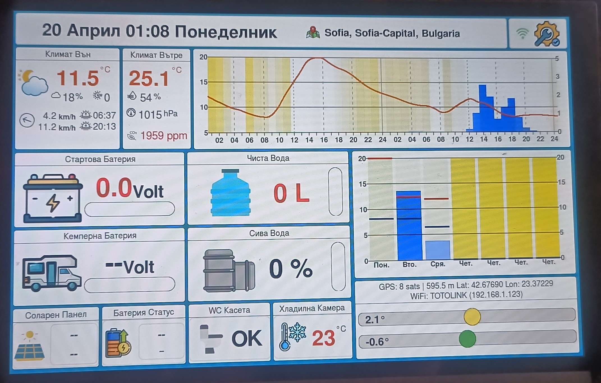

# Camper Weather & Information Station

<p align="center">
  
</p>

A high-performance, fully autonomous environmental, navigation, and energy monitoring system for campers, RVs, and off-grid setups — powered by ESP32-P4.

---

## 🚀 Overview

This project combines weather forecasting, GNSS positioning, energy monitoring, environmental sensing, audio notifications, and a modern LVGL-based user interface into a single embedded system.

It is designed for:
- reliability
- modularity
- long-term off-grid operation

---

## 🌍 Core Features

### 📍 Geolocation & Timekeeping
- GNSS positioning (NMEA / u-blox compatible)
- Automatic time synchronization via GPS
- DS3231 RTC for persistent timekeeping
- Automatic timezone detection based on GPS coordinates
- No NTP required

---

### 🌦 Weather & Forecasting
- Live data from Open-Meteo API
- Temperature, humidity, pressure
- UV index, cloud cover, precipitation
- Graphical forecast with icons
- Automatic periodic updates

---

### 🔋 Energy Monitoring
- Victron SmartSolar integration (UART)
- Battery voltage, current, charge state
- Solar charging status
- Real-time telemetry

---

### 🌱 Environmental Sensors
- Fresh water tank level
- Grey water tank level
- WC cassette status
- Fridge temperature monitoring
- CO₂ measurement
- Ambient light sensor (ALS)
- Automatic display dimming

---

### 🖥 User Interface
- LVGL-based UI (optimized for 10.1" DSI display)
- Smooth animations and transitions
- Multi-screen layout
- Touch support
- Day/Night themes

---

## 🔊 Audio Subsystem

A modular, event-driven audio system designed for flexibility and reliability.

### 🎵 Audio Manager
- Non-blocking playback
- Event-driven triggers
- Priority queue for overlapping sounds
- Automatic amplifier control
- Fade-in / Fade-out transitions
- Playback callbacks
- Hourly chime (24-hour format)
- Smart suppression during display dimming

---

### 📁 Audio Storage (Flash / SD)
- WAV playback support
- Directory-based organization
- Fast file access
- Optional SD card support
- Fallback mechanisms

---

### 🔔 Audio Events
- GPS status (fix / lost)
- Wi-Fi connection status
- Alerts and warnings
- Touch feedback
- Alarm signals
- Hourly announcements (01–24)
- Smart mute during night/dim mode

---

## 💾 Storage System

Supports both:

- Internal Flash (FATFS partition)
- SD Card (SDMMC)

### Features:
- FAT filesystem
- High-speed audio streaming
- Structured file organization
- Optional hot-swap detection

### Recommended Structure:
/storage/audio/
system/
alerts/
battery/
camper/
gps/
hours/
wifi/


---

## 🧩 Project Architecture
components/
core/ – system utilities
network/ – Wi-Fi, HTTP, Open-Meteo
drivers/ – display, GPS, RTC, sensors, Victron
audio/ – Audio Manager + Audio Events
tasks/ – FreeRTOS tasks
ui/ – LVGL interface

main/
main.cpp – system entry point


---

## 🧵 FreeRTOS Task Model

- GPS Task  
- Weather Task  
- Wi-Fi Task  
- UI Task  
- Time Sync Task  
- Sensor Task  
- Audio Task  
- Storage Task  

All tasks communicate via event queues.

---

## 🛠 Technologies

- ESP-IDF
- FreeRTOS
- LVGL
- FATFS
- I2C / UART / Wi-Fi
- C / C++

---

## 🔧 Build Instructions

```bash
idf.py set-target esp32p4
idf.py build
idf.py flash
idf.py monitor

🎯 Project Goal

To build a robust, modular, and visually rich embedded system that provides:

real-time weather data
navigation
energy monitoring
environmental sensing
audio alerts
intuitive UI

Optimized for campers and off-grid environments.

🔄 OTA Update (Over-The-Air)

The system supports full OTA firmware updates via web browser — no USB connection required.

Features:
ESP-IDF HTTP server
A/B OTA partitions (ota_0 / ota_1)
Automatic firmware switching
Image validation before boot
Safe fallback on failure

🌐 How to Update
Connect the device to Wi-Fi
Open a browser and enter:
http://<device-ip>/update

Example:

http://192.168.1.123/update
Upload the .bin file from the build/ directory
Click Update
Wait for completion
Device will reboot automatically


👤 Development Notes

This project is developed using:

ChatGPT
GitHub Copilot
AI-assisted architecture design
Modular component-based approach
