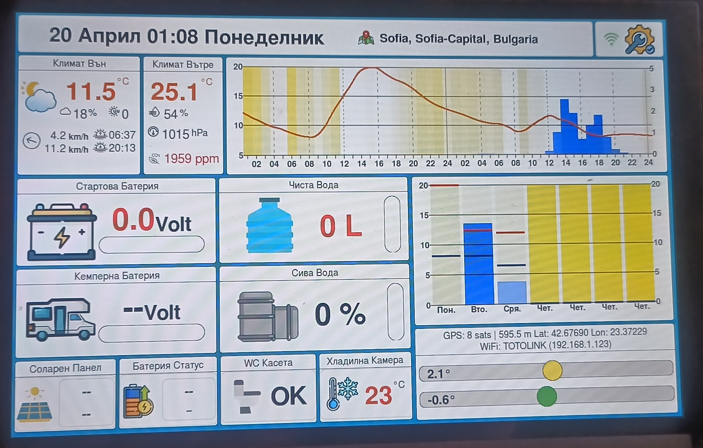

# Camper Information & Monitoring System

  

## User Interface

The Camper Information & Monitoring System has been designed around a simple and intuitive user interface that minimizes navigation while providing immediate access to all important information.

Unlike many embedded applications that rely on numerous menus and screens, this project uses only **two primary screens**:

- **Main Dashboard** – the central screen containing all monitoring and control functions.
- **Settings** – configuration of the entire system.

This design philosophy allows the user to access weather information, vehicle status and all camper subsystems with minimal interaction, making the system easier and safer to use during everyday travel.

---

## Display Support

The graphical interface was originally designed for the **Waveshare 10.1-inch DSI Capacitive Touch Display** with a native resolution of **1280 × 800**.

The available screen area allows the complete dashboard to be displayed without overcrowding the interface. Weather information, GPS, energy monitoring, water tank levels, refrigerator control, camper leveling and system status are presented simultaneously in clearly separated sections.

The project is currently developed and tested on the **Waveshare 5-inch DSI Capacitive Touch Display** with a resolution of **1280 × 720**.

Because the 5-inch display provides 80 fewer vertical pixels than the original design, some pages require a short vertical touch scroll to access the lower part of the dashboard. This affects only the visible area—the complete functionality of the application remains available without modification.

Display support currently includes:

| Display | Resolution | Status |
|---------|------------|--------|
| Waveshare 10.1" DSI Capacitive Touch Display | 1280 × 800 | Original user interface design |
| Waveshare 5" DSI Capacitive Touch Display | 1280 × 720 | Current development and testing platform |

---

## Main Dashboard

The Main Dashboard integrates all major camper subsystems into a single screen.

Displayed information includes:

- Current weather conditions
- Multi-day weather forecast
- GPS position and navigation data
- Date and time
- Victron SmartSolar MPPT monitoring (VE.Direct UART)
- Fresh water tank level
- Grey water tank level
- Camper leveling assistant
- Alpicool refrigerator monitoring and control
- LTE communication status
- Wi-Fi connection status
- System notifications and alarms

The dashboard has been carefully arranged to maximize information density while maintaining readability on the target 10.1-inch display.

---

## Camper Leveling Assistant

The project includes a precision leveling assistant based on the **MPU6050** 6-axis inertial measurement unit.

Using accelerometer and gyroscope data, the system continuously measures the camper's pitch and roll and presents the information graphically on the display.

This enables accurate vehicle leveling before parking, improving comfort and ensuring proper operation of equipment such as the refrigerator.

Features include:

- Real-time pitch and roll measurement
- High-precision graphical leveling indicator
- Fast sensor updates
- Continuous visual feedback
- Integrated directly into the main dashboard
